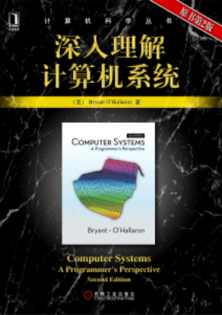

# CSAPP

CSAPP[《深入理解计算机系统》](https://book.douban.com/subject/5333562/)

## 目录

- 第一章 计算机系统漫游

  [00 前言](./notes/chapter-01/00前言.md)

  [01 正文](./notes/chapter-01/01正文.md)

- 第二章 信息的表示和处理

  [00 前言](./notes/chapter-02/00前言.md)

  [01 正文](./notes/chapter-02/01正文.md)

- 第三章 程序的机器级表示

  [00 前言](./notes/chapter-03/00前言.md)

  [01 正文](./notes/chapter-03/01正文.md)

- 第六章 存储器层次结构

  [00 前言](./notes/chapter-06/00前言.md)
  [01 正文](./notes/chapter-06/01正文.md)
