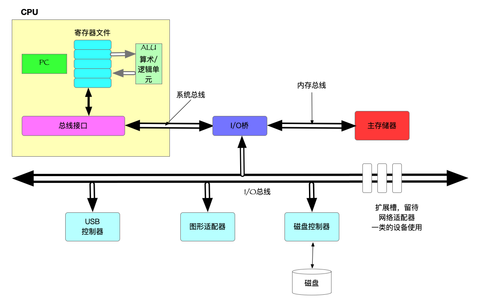
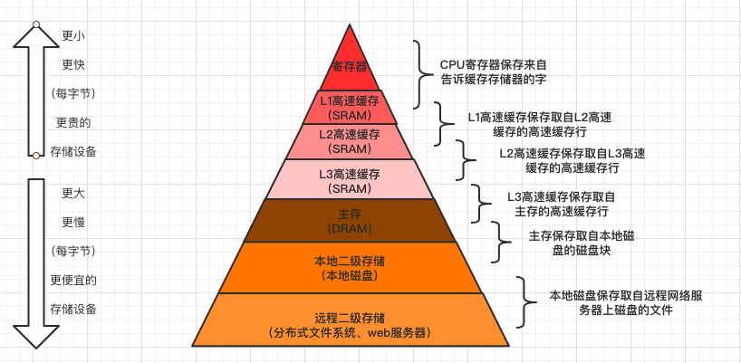
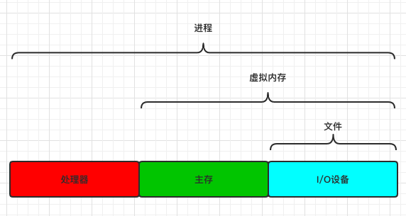
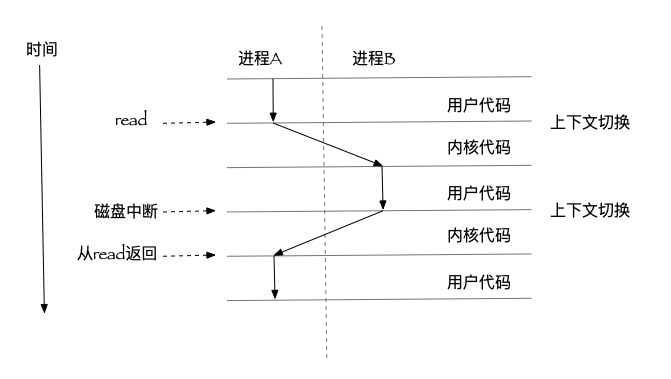
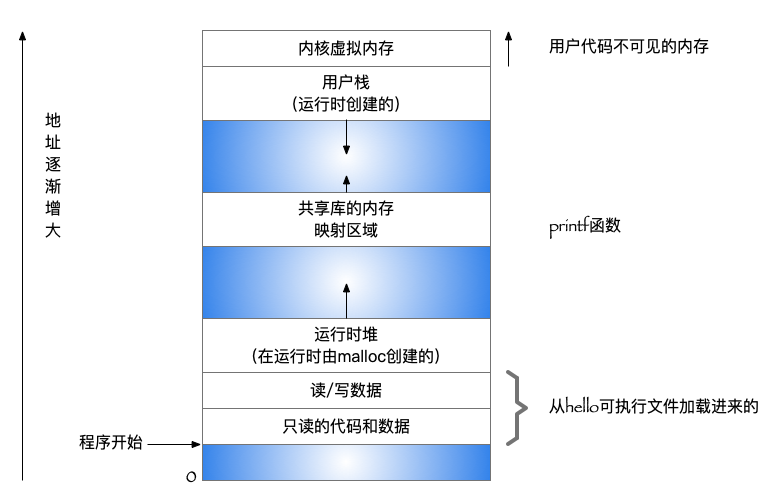

[toc]
## 1.1 信息就是位+上下文

一个源程序 [hello.c](../../code/intro/hello.c)

- 1个字节 = 8位

- ASCII 用一个唯一的 *单字节* 大小的整数值表示 *每个* 字符
- 系统中的所有的信息————包括磁盘文件、存储器中的程序、存储器中存放的用户数据以及网络上传送的数据，都是由 *一串位* 表示
- 区分不同数据对象的方式，是读到这些数据对象时的上下文。在不同的上下文中，一个相同的位序列可以表示不同的内容，或者是整数、浮点数、字符串或者机器指令
- 文本文件和二进制文件
    > 只有ASCII字符构成的文件称为文本文件，其他所有文件都称为二进制文件

## 1.2 程序被其他程序翻译成不同的格式

- hello 程序编译过程
    > 每条C语句都必须被其他程序转化为一系列的低级机器语言指令。
    > 这些指令按照 *可执行目标程序* 格式打包，并以二进制形式存放

- Unix系统上的编译：
    - `gcc -o hello hello.c`
- 编译系统
    - 预处理器、编译器、汇编器、链接器


- 预处理阶段(cpp)
    > 根据以字符 # 开头的命令，修改原始的 C 程序，得到另一个C程序，通常使用 i 作为文件扩展名

- 编译阶段(ccl)
    > 将文本 hello.i 翻译成 hello.s，包含一个汇编语言程序
    > 每一条汇编语句都以一种标准的文本格式确切地描述了一条低级语言指令。
    > 汇编语言为不同的高级语言的不同编译器提供了通用的输出语言

- 汇编阶段(as)
    > 汇编器将 hello.s 翻译成机器语言指令，将指令按照 可重定位目标程序 的格式保存在 hello.o 二进制文件中
- 链接阶段(ld)
    > hello程序调用了printf函数，是标准C库中的一个函数，存在于一个名为 printf.o 的单独预编译好的目标文件中，链接器负责将这种文件以某种方式合并到hello.o文件中。结果得到hello文件，是一个可执行目标文件
    > 目标文件可以被加载到内存中，由系统执行

## 1.3 了解编译系统如何工作是大有益处的
- 优化程序性能
    - switch是否总比if-then-else高效？
    - 一个函数调用的开销有多大？
    - while比for更有效吗？
    - 指针引用比数组索引更有效吗？
    - 为什么将循环求和的结果放到一个本地变量中，与将其放到一个通过引用传递过来的参数中相比，运行速度快很多？
    - 为什么我们只是简单重新排列一下一个算术表达式中的括号就能让一个函数运行的更快？
    
- 理解链接时出现的错误
    - 链接器报告它无法解析一个引用时什么意思？
    - 静态变量和全局变量的区别是什么？
    - 静态库和动态库的区别是什么？
    - 在命令行上排列库的顺序有什么影响？
    - 为什么有些链接错误直到运行时才会出现？
- 避免安全漏洞
    - 理解数据和控制信息存储在程序栈上的方式会引起的后果。

## 1.4 处理器读并解释储存在内存中的指令
- 在shell中，如果命令行的第一个单词不是内置的shell命令，那么shell就会假设这是一个可执行文件的名字。它将加载并运行这个文件

### 1.4.1 系统的硬件组成
*一个典型系统的硬件组成*

_CPU:中央处理单元；ALU:算术/逻辑单元;PC:程序计数器；USB: 通用串行总线_
- 总线
    > 贯穿整个系统的一组电子管道
    
    > 在各个部件间传递信息字节

    > 通常传送定长的字节快，也就是 字 (word)
    
    > 字中的字节数 叫 字长
    
    > 32位机一个字长为4个字节（4\*8位），64位机一个字长为8个字节（8\*8位）
- I/O设备
    > 系统与外界的联系通道，比如键鼠、显示器、磁盘

    > 每个I/O设备通过一个控制器或适配器与I/O总线相连
            
            适配器和控制器的区别：
            封装方式不同
                控制器是I/O设备本身或者系统的主板上的芯片组
                适配器是一块插在主板插槽上的卡
- 主存储器
    > 一个临时存储设备，在处理器执行程序时，用来存放程序和程序处理的数据。

    > 物理：由一组 *动态随机存取存储器(DRAM)* 芯片组成

    > 逻辑：一个线性的字节数组，每个字节都有唯一的地址，从零开始
- 处理器(CPU)
    > 解释（或执行）存储在主存中指令的 *引擎*

    > 核心是一个大小为一个字的存储设备(或寄存器),称为程序计数器(PC),在任何时候，PC都指向主存中的某条机器语言指令(即含有该条指令的地址)。
    
    > 从系统通电到断电，处理器一直不断地执行程序计数器指向的指令，再更新程序计数器，使其指向下一条指令。

    > 处理器 看上去是按照一个非常简单的指令执行模型来操作的，这个模型是由指令集架构决定的。

    > 在这个模型中，指令按照严格的顺序执行，而执行一条指令包括执行一系列的步骤。

    > 处理器从程序计数器指向的内存处读取指令，解释指令中的位，执行该指令的简单操作，然后更新PC，使其指向下一条指令，而这条指令并不一定和在内存中刚刚执行的指令相邻。
            
    - 加载：从主存复制一个字节或者一个字到寄存器，覆盖寄存器原来的内容。
    - 存储：从寄存器复制一个字节或者一个字到主存的某个位置，覆盖这个位置原来的内容。
    - 操作：把两个寄存器的内容复制到ALU，ALU对这两个字做算术运算，并将结果存放到一个寄存器中，覆盖该寄存器原来的内容。
    - 跳转：从指令本身中抽取一个字，并将这个字复制到PC中，覆盖PC中原来的值。

### 1.4.2 运行hello程序
    `$ ./hello`
    shell程序将字符逐一读入寄存器，再放到内存中
    回车
    shell知道我们结束了命令的输入,执行一系列指令，加载可执行的hello文件（从磁盘到主存）, 包括最终会被输出的字符串"hello,world\n"
    hello文件中的代码和数据被加载到主存，处理器就开始执行hello程序的main程序中的机器语言指令。
    将 "hello, world\n"字符串中的字节从主存复制到寄存器
    再从寄存器文件中复制到显示设备

## 1.5 告诉缓存至关重要
- 系统花费了大量的时间把信息从一个地方挪到另一个地方
- 较大的存储设备比 较小的存储设备 运行的慢
- 快速设备的造价高于同类的低速设备
- L1高速缓存的容量可以达到数万字节，访问速度几乎和访问寄存器文件一样快。
- L2高速缓存，容量可达到数十万到数百万字节，访问时间比L1长5倍。
- L1和L2是用一种叫做静态随机访问存储器(SRAM)的硬件技术实现的。
- 局部性原理：程序具有访问局部区域里的数据和代码的趋势

## 1.6 存储设备形成层次结构



- 存储器层次结构的主要思想是：上一层的存储器作为低一层存储器的高速缓存

## 1.7 操作系统管理硬件
- 所有应用程序对硬件的操作尝试都必须通过操作系统
- 操作系统的两个功能：
    - 防止硬件被时空的应用程序滥用
    - 向应用程序提供简单一致的机制来控制复杂而又通常大不相同低级硬件设备。
    
    *操作系统通过几个基本的抽象概念（进程、虚拟内存、文件）来实现这两个功能*
    

### 1.7.1 进程
- 进程是操作系统对一个正在运行的程序的一种抽象
- 并发运行，指一个进程的指令和另一个进程的指令是 *<font color="red">交错执行</font>* 的
- 操作系统实现这种交错执行的机制称为 *<font color="red">上下文切换</font>* 
- 操作系统保持跟踪进程运行所需的所有状态信息。这种状态，就是 *<font color="red">上下文</font>* 
> 上下文：包括许多信息，比如PC和寄存器文件的当前值，主存的内容

- 当操作系统决定要把控制权从当前进程转移到某个新进程时，就会进行上下文切换
> 上下文切换：保存当前进程的上下文，恢复新进程的上下文，然后将控制权传递到新进程，新锦成就会从它上次停止的地方开始

- 进程切换是由操作系统内核(kernal)管理的
- 内核是操作系统代码常驻主存的部分
- 内核不是一个独立的进程，是系统管理全部进程所用代码和数据结构的集合

### 1.7.2 线程
- 每个线程都运行在进程的上下文中，并共享同样的代码和全局数据

### 1.7.3 虚拟内存
- 虚拟内存是个抽象的概念，为每个进程都提供了一个假象，貌似每个进程都独占地使用主存。
- 每个进程看到的内存地址都是一致的，成为虚拟地址空间。
- 基本思想是：把一个进程虚拟内存的内容存储在磁盘，然后用主存作为磁盘的高速缓存。

    - 每个进程看到的虚拟地址空间都由大量的准确定义的区组成
    - 程序代码和数据
        > 对于所有的进程，代码是从同一固定地址开始，紧接着是和C全局变量相对于的数据位置
        > 代码和数据区是直接按照可执行目标文件的内容初始化的(例如hello)
    - 堆
        > 由malloc创建，当调用malloc或free这样的C标准库函数时，堆可以动态地扩展和收缩 
    - 共享库
        > 地址空间的中间部分是一块用来存放像C标准库和数学库这样的共享库的代码和数据的区域
    - 栈
        > 位于用户虚拟地址空间顶部，编译器用它来实现函数调用，和堆一样，用户栈在程序执行期间可以动态的扩展和收缩。
        > 不同的，每次调用一个函数，栈就会增长，从一个函数返回时，栈会收缩
    - 内核虚拟内存
        > 为内核保留，不允许应用程序读写或者直接调用
### 1.7.4 文件
- 文件就是字节序列
- Unix体系，一切皆文件
- 向应用程序提供了一个统一的视图，来看待系统中可能含有的所有各式各样的I/O设备。

## 1.8 系统之间利用网络通信


## 1.9 重要主题
- 系统是硬件和系统软件相互交织的集合体，共同协作运行应用程序。

### 1.9.1 Amdahl定律(安达尔定律)
- 主要思想：当我们对 系统 的某个部分加速时，其对系统整体性能的影响 取决于 该部分的 重要性 和  加速程度。若通执行某应用程序需要时间 为   <font color="red">T<sub>old</sub></font>, 假设系统某部分所需执行时间与该时间比例为 <font color="red">α</font>，而该部分性能提升比例为 <font color="red">k</font>。即 该部分初始所需时间为 <font color="red">αT<sub>old</sub></font>，现在所需时间为(<font color="red">αT<sub>old</sub>/k</font>).因此，总的执行时间应为：
--------------------------------
> T<sub>new</sub> = (1 - α)T<sub>old</sub> + (αT<sub>old</sub>)/k = T<sub>old</sub>\[(1 - α)+α/k\]
------------------------
由此，可以计算加速比 
> S = 1/((1 - α)+α/k)

- 从公式可以看出，α越大，越能显著加速整体系统

可得出Amdahl定律的主要观点：
> 要想显著加速整个系统，必须提升全系统中相当大的部分的速度

#### 练习题1.1
```
将土豆从A运送到B，全程2500公里，在限速范围内，平均速度为100公里/小时，整体形成需要25个小时。
A. 有一段路取消了限速，其中1500公里可以为150公里/小时。那么这对整个形成的加速比是多少？
B. 如果想要整个行程的加速比为1.67x，那么必须以多快的速度通过这1500公里？
```
解答
```
A. 根据加速比的结论公式： S = 1/(1 - α + α/k)
可知，如果想要得到加速比S，需要知道 α和k

根据题目：
α = 1500 / 2500 = 0.6
k = 150 / 100 = 1.5

S = 1/(1 - α + α/k) = 1 / (1 - 0.6 + 0.6/1.5) = 1/0.8 = 1.25

所以：加速比为 1.25x

B. 如果想要整个形成加速比为1.67x，则表示  S = 1.67，求100k

根据加速比公式   S = 1/(1 - α + α/k)

代入参数
1.67 = 1 / (1 - 0.6 + 0.6 / k )
求出k = 1.8，100k = 180

故得出结论：需要以 180公里/小时的速度通过这1500公里
```
#### 练习题1.2
```
将下个版本的软件性能改进2x。确认只有80%的系统能够被改进，那么这部分需要被改进多少(k取何值)，才能达到整体性能目标？
```
解答
```
从题目可知，S = 2，α = 0.8，求k

根据加速比公式   S = 1/(1 - α + α/k)

代入参数
2 = 1 / (1 - 0.8 + 0.8/k)

得出 k = 2.67
```
Amdahl定律的特殊情况：
k趋向于 ∞，意味着，可以将系统的某一部分加速到一个点，在这个点上，这部分花费的时间可以忽略不计，公式就变成
> S<sub>∞</sub> = 1 / (1 - α)

假如 60%的系统能够加速到不花时间的程度，我们获得的净加速比也只有 1 / (1 - 0.6) = 2.5x


### 1.9.2 并发和并行
*做的更多，运行的更快*
- 并发是个通用的概念，指一个同时具有多个活动的系统
- 并行指用并发来使一个系统运行得更快。

并行是个可以在计算机系统的多个抽象层次上运用。

##### a. 线程级并发
- 使用线程，我们甚至能够在一个进程中执行多个控制流

##### b. 指令级并行

##### c. 单指令、多数据并行
