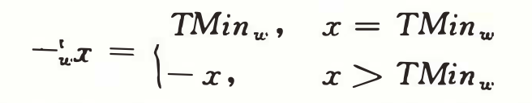

# 正文

## 2.1 信息存储
- 1字节 = 8位 = 最小的可寻址的内存单位
- 虚拟内存：机器级程序将内存视为一个非常大的<font color="red">*字节数组*</font>，成为虚拟内存
- 内存的每个字节都由一个唯一的数字来标识，称为它的<font color="red">*地址*</font>，所有可能地址的集合称为<font color="red">*虚拟地址空间*</font>

### 2.1.1 十六进制表示法
- 十六进制使用数字 0 ~ 9 以及 A ~ F 来表数16个可能的值。
- 以`0x`或 `0X`开头的数字常量被认为是十六进制的值。字符 A ~ F可以大写或者小写。

| 十六进制数字 | 0 | 1 | 2 | 3 | 4 | 5 | 6 | 7 | 8 | 9 | A | B | C | D | E | F |
| :---: | :---: | :---: | :---: | :---: | :---: | :---: | :---: | :---: | :---: | :---: | :---: | :---: | :---: | :---: | :---: | :---: |
| 十进制值 | 0 | 1 | 2 | 3 | 4 | 5 | 6 | 7 | 8 | 9 | 10 | 11 | 12 | 13 | 14 | 15 |
| 二进制值 | 0000 | 0001 | 0010 | 0011 | 0100 | 0101 | 0110 | 0111 | 1000 | 1001 | 1010 | 1011 | 1100 | 1101 | 1110 | 1111 |

#### 练习题2.1 完成数字转换
A. 将 0x39A7F8 转换为二进制
解答：11 1001 1010 0111 1111 1000
B. 将二进制 1100100101111011 转换为十六进制
解答：OxC97B
C. 将 0xD5E4C 转换为二进制
解答：1101 0101 1110 0100 1100
D. 将二进制 10 0110 1110 0111 1011 0101 转换为十六进制
解答：0x26E7B5

*小技巧*
> 当值 x = 2<sup>n</sup> ,n 为非负整数时，很容易将x写成十六进制。x的二进制表示就是1后面跟n个0
> 当 n 表示成 i +4j 形式，其中 0 <= i <= 4,可以把x写成，开头的十六进制数字为1(i=0),2(i=1),4(i=2),8(i=3),后面跟着j个十六进制的0。
> 比如  4096 = 2<sup>12</sup>,n = 12 = i + 4j = 0 + 4 *3。i = 0,j = 3,可得出 4096的十六进制为 0x1000。

#### 练习题2.2 填写表中的空白项，给出2的不同次幂的二进制和十六进制表示：
| n | 2<sup>n</sup>(十进制) | 2<sup>n</sup>(十六进制) |
| :---: | :---: | :---: |
| 9 | 512 | 0x200 |
| 19 | <font color="red">524288</font> | <font color="red">0x80000</font> | 
| <font color="red">14</font> |16384| <font color="red">0x4000</font> |
| <font color="red">16</font> | <font color="red">65536</font> |0x10000|
|17| <font color="red">131072</font> | <font color="red">0x20000</font> |
| <font color="red">5</font> |32| <font color="red">0x20</font> |
| <font color="red">7</font> | <font color="red">128</font> |0x80|

*小技巧*
>  十进制转十六进制：反复除以16，得到商和余数，余数作为最低位，继续用商除以16，直到最后

> 十六进制转十进制：用响应的16的幂乘每个十六进制数字。

#### 练习题2.3 一个字节可以用两个十六进制数字来表示。填写下表，给出不同的字节模式的二进制、十进制、十六进制的值。

| 十进制 | 二进制 | 十六进制 |
| :---: | :---: | :---: |
| 0 | 0000 0000 | 0x00 |
| 167 | <font color="red">1010 0111</font> | <font color="red">0xA7</font> | 
| 62 | <font color="red">0011 1110</font> | <font color="red">0x3E</font> |
| 188 | <font color="red">1011 1100</font> |<font color="red">0xBC</font> |
| <font color="red">55</font>| 0011 0111 | <font color="red">0x37</font> |
| <font color="red">136</font> |1000 1000 | <font color="red">0x88</font> |
| <font color="red">243</font> | 1111 0011 |<font color="red">0xF3</font> |
| <font color="red">82</font> | <font color="red">0101 0010</font> |0x52|
| <font color="red">172</font> | <font color="red">1010 1100</font> |0xAC|
| <font color="red">231</font> | <font color="red">1110 0111</font> |0xE7|

#### 练习题2.4 算术题
A. 0x503c + 0x8 = <font color="red">0x5044</font>

B. 0x503c - 0x40 = <font color="red">0x4FFC</font>

C. 0x503c + 64 = <font color="red">0x507C</font>

D. 0x50ea - 0x503c = <font color="red">0xAE</font>

### 2.1.2 字数据大小
- 字长指明指针数据的标称大小，因为虚拟地址是以一个字来编码的。
- 对于一个字长为w位的机器而言，虚拟地址的范围为2<sup>w</sup>-1

- 基本C数据类型的典型大小

| C声明 |  | 字节数 ||
| :---: | :---: | :---: | :---: |
| 有符号 | 无符号 | 32位 | 64位 |
| [signed] char | unsigned char | 1 | 1 |
| short | unsigned short | 2 | 2 |
| int | unsigned | 4 | 4 |
| long | unsigned long | 4 | 8 |
| int32_t | uint32_t | 4 | 4 |
| int64_t | uint64_t | 8 | 8 |
| char * | | 4 | 8 |
| float | | 4 | 4 |
| double | | 8 | 8 |

### 2.1.3 寻址和字节顺序
- 小端法：最低有效字节在最前面的方式
- 大端法：最高有效字节在最前面的方式

### 2.1.4 表示字符串
### 2.1.5 表示代码
### 2.1.6  布尔代数简介
- 布尔代数在二元集合{0, 1} 基础上定义。 ~、&、| 、 ^

### 2.1.7 C语言中的位级运算

### 2.1.8 C语言中的逻辑运算

### 2.1.9 C语言中的移位运算
- 左移：x << k, x向左移动k位，丢弃最高的k位，并在右端补k个0。[x<sub>w-k-1</sub>,...,x<sub>w-k-1</sub>,...,x<sub>0</sub>,0,...,0]
- 右移：x >> k：
- 逻辑右移：在左端补 k 个 0，[0,...,0,x<sub>w-1</sub>,x<sub>w-2</sub>,...,x<sub>k</sub>]
- 算术右移：在左端补 k 个最高有效位的值，[x<sub>w-1</sub>,...,x<sub>w-1</sub>,x<sub>w-1</sub>,x<sub>w-2</sub>,...,x<sub>k</sub>]

- 实际上，几乎所有的编译器/机器组合都对有符号数使用算术右移，且许多程序员也都假设机器会使用这种右移。
- 另一方面，对于无符号数，右移必须是逻辑的。
- Java中， x >> k ，是算术右移，x >>> k ，是逻辑右移。

## 2.2 整数表示
- 只能表示非负数
- 能够表示负数、零、正数
- 扩展或收缩一个已编码整数以适应不同长度表示

> 一些数学术语，精确定义和描述计算机如何编码和操作整数。（w表示位数）

| 符号 | 类型 | 含义 |
| :---: | :---: | :---: |
| B2T<sub>w</sub> | 函数 | 二进制转补码 |
| B2U<sub>w</sub> | 函数 | 二进制转无符号 |
| U2B<sub>w</sub> | 函数 | 无符号转二进制 |
| U2T<sub>w</sub> | 函数 | 无符号转补码 |
| T2B<sub>w</sub> | 函数 | 补码转二进制 |
| T2U<sub>w</sub> | 函数 | 补码转无符号 |
| TMin<sub>w</sub> | 常数 | 最小补码值 |
| TMax<sub>w</sub> | 常数 | 最大补码值 |
| UMax<sub>w</sub> | 常数 | 最大无符号数 |
| +<sup>t</sup><sub>w</sub> | 操作 | 补码加法 |
| +<sup>u</sup><sub>w</sub> | 操作 | 无符号加法 |
| *<sup>t</sup><sub>w</sub> | 操作 | 补码乘法 |
| *<sup>u</sup><sub>w</sub> | 操作 | 无符号乘法 |
| -<sup>t</sup><sub>w</sub> | 操作 | 补码取反 |
| -<sup>u</sup><sub>w</sub> | 操作 | 无符号取反 |

### 2.2.1 整型数据类型
- C语言标准定义了每种数据类型必须能够表示的最小的取值范围。
> C语言的整数数据类型的保证的取值范围

| C数据类型 | 最小值 | 最大值 |
| :---: | :---: | :---: |
| [signed]char | -127 | 127|
| unsigned char | 0 | 255 |
| short |  -32767 | 32767 |
| unsigned short | 0 | 65535 |
| int | -32767 | 32767 |
| unsigned int | 0 | 65535 |
| long | -2147 483 647 | 2147 483 647 |
| unsigned | 0 | 4294 967 295 |
| int32_t | -214748364 | 214748364 |
| uint32_t | 0 | 2147 483 647 |
| int64_t | -9223372036854775808 | 9223372036854775807 |
| uint64_t | 0 | 18446744073709551615 |

### 2.2.2 无符号数的编码
> B2U<sub>w</sub> = ∑ x<sub>i</sub>2<sup>i</sup>

> UMax<sub>w</sub> = ∑ 2<sup>i</sup> = 2<sup>w</sup> - 1

- 每个介于 0~2<sup>w</sup> - 1 之间的数都有唯一一个w位的值编码。 

- 函数B2U<sub>w</sub>是一个双射。反过来即是 U2B<sub>w</sub> ：在0~2<sup>w</sup> - 1之间的每一个整数都可以映射为一个唯一的长度为w的位模式

### 2.2.3 补码编码
- 最常见的有符号数的计算机表示方式就是补码形式。将字的最高有效位解释为负权。
- 补码定义：
> B2T<sub>w</sub> = -x<sub>w-1</sub>2<sup>w-1</sup> + ∑x<sub>i</sub>2<sup>i</sup>
- 最高有效位 x<sup>w-1</sup> 也成为符号位，权重为 -2<sup>w-1</sup>，是无符号表示中权重的负数。

<font color="red">*符号位被设置为1时，表示值为负，设置为0时，值为非负*</font>

- 补码编码的唯一性
- 函数 B2T<sub>w</sub> 是一个双射。反过来即是 T2B<sub>w</sub>

### 2.2.4 有符号数和无符号数之间的转换
- 多种可能
> 1、两种形式都能表示的值，想保持不变    
> 2、将负数转换成无符号数可能会得到 0     
> 3、如果转换的无符号数太大以至于超出了补码能表示的范围，可能会得到 T<sub>max</sub>

- C语言中，要从位级角度来看，不是从数的角度

```C
short int v = -12345;
unsigned short uv = (unsigned short)v;
printf("v = %d, uv = %u\n", v, uv);
```
得到输出：`v = -12345, uv = 53191`

```C
unsigned u = 4294967295u;
int tu = (int)u;
printf("u = %u, tu=%d\n", u, tu);
```
得到输出：`u = 4294967295u, tu = -1`

- 综合得出：处理同样字长的有符号数和无符号数之间相互转换的一般规则是：
> 数值可能会改变，但是位模式不变。

### 2.2.5 C语言中的有符号数与无符号数
- 一台采用补码的机器上，当从无符号数转换为有符号数时，效果就是应用函数U2T<sub>w</sub>，而从有符号数转换为无符号数时，就是应用函数T2U<sub>w</sub>。

### 2.2.6 扩展一个数字的位表示
- 要将一个无符号数转换为一个更大的数据类型，我们只要简单地在表示的开头添加0。这种运算被称为零扩展

### 2.2.7 截断数字
- 当将一个w位的数 x 向量 = [x<sub>w-1</sub>,x<sub>w-2</sub>,...,x<sub>0</sub>]阶段为一个k位数字时，我们会丢弃高 w - k位，得到一个位向量 x` = [x<sub>k-1</sub>,x<sub>k-2</sub>,...,x<sub>0</sub>]。

- 截断一个数字可能会改变它的值 —— 溢出的一种形式。

### 2.2.8 关于有符号数与无符号数的建议

## 2.3 整数运算
### 2.3.1 无符号加法

### 2.3.2 补码加法

### 2.3.3 补码的非
对于满足 TMin<sub>w</sub> <= x <= TMax<sub>w</sub>的x，其补码的非 -<sub>w</sub><sup>t</sup>x 由下式给出

*对于w位的补码加法来说，TMin<sub>w</sub>是自己的加法的逆，而对于其他任何数值，x都有-x作为其加法的逆。*
### 2.3.4 

